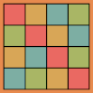
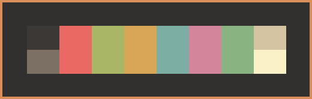
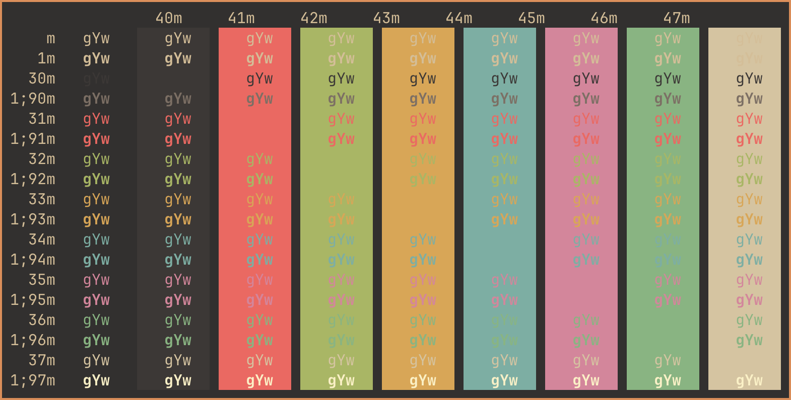

# Gruvbox Material Dark Soft Ghostty
Gruvbox Material Dark Soft for Ghostty.

 

* [Ghostty for macOS and Linux](https://ghostty.org/)

* [Gruvbox color scheme](https://github.com/morhetz/gruvbox)

* [Gruvbox Material](https://github.com/sainnhe/gruvbox-material) 

Place file in ~/.config/ghostty/themes/ (create folders if non-existing).

*Gruvbox Material Dark Soft*

 

